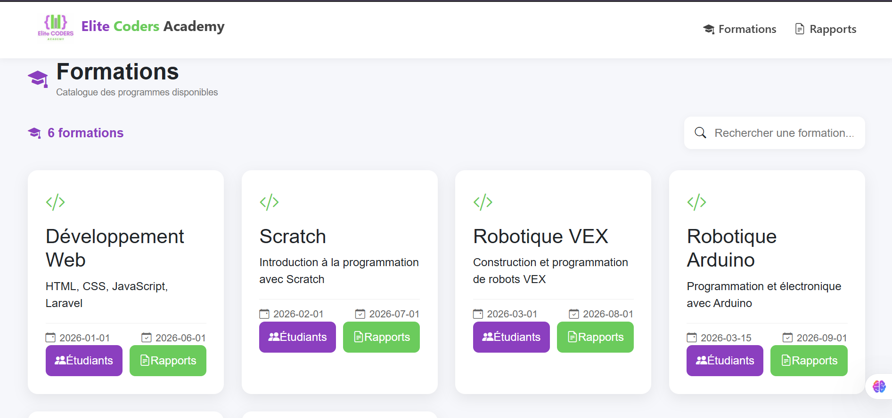
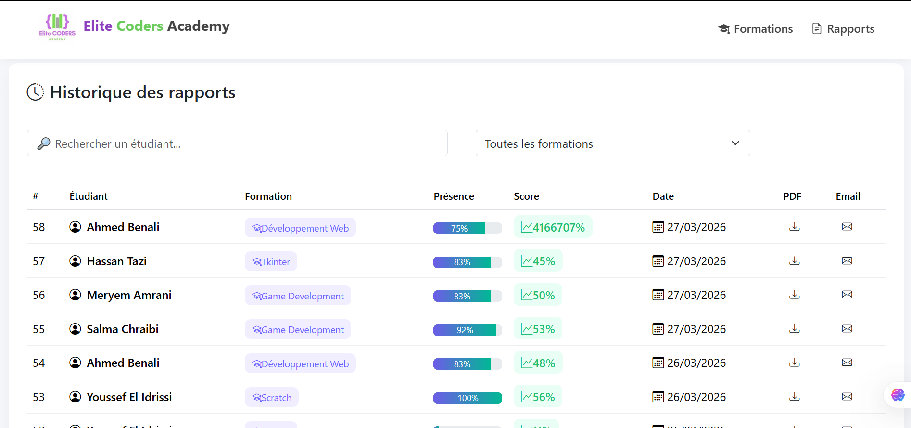
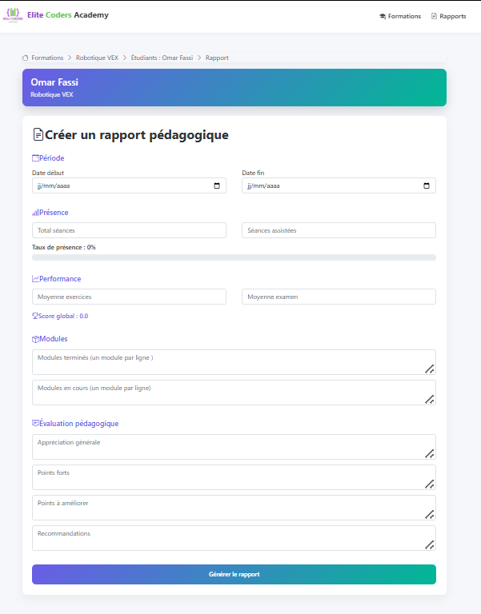
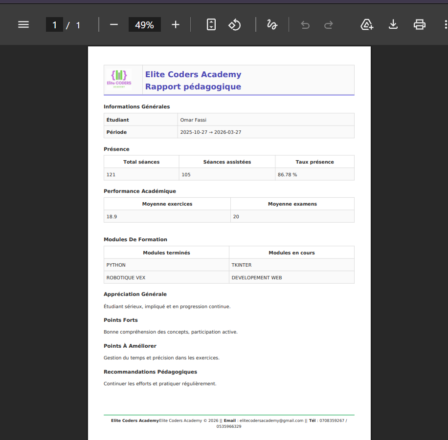
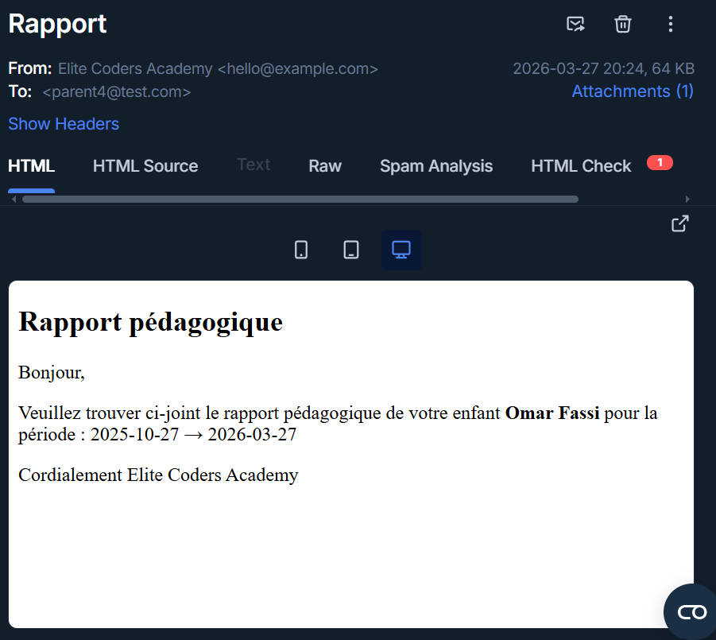

# 🎓 Générateur Automatique de Rapports Parents

<p align="center">
  
</p>

<p align="center">
  <b>Application web complète permettant la génération automatique de rapports pédagogiques avec export PDF et envoi email</b>
</p>

---

## 🚀 Badges


---

## 📌 Description

Ce projet consiste à développer une application web permettant de générer automatiquement des rapports pédagogiques destinés aux parents.

### 🎯 Objectifs

- 📊 Centraliser les informations des étudiants
- 📝 Faciliter la saisie des données pédagogiques
- 📄 Générer automatiquement des rapports PDF
- 📧 Envoyer les rapports par email avec pièce jointe
- 🕓 Conserver un historique des rapports

---

## 🖼️ Aperçu de l’application

### 📊 Report History

<p align="center">
  
</p>

---

### 📝 Création de rapport

<p align="center">
  
</p>

---

### 📄 Génération PDF

<p align="center">
  
</p>

---

### 📧 Envoi Email

<p align="center">
  
</p>

---

## 🧠 Architecture du projet

### 🔙 Backend (Laravel)

- Controllers (Formation, Report)
- Models (Student, Formation, Report)
- Mail (envoi PDF)
- API REST
- Blade (PDF + Email)

### 🎨 Frontend (React)

- Composants modulaires
- Gestion d’état (useState, useEffect)
- Navigation (React Router)
- API (Axios)

---

## 📝 Documentation du code

Le projet est entièrement commenté :

✔ Controllers  
✔ Models  
✔ Mail  
✔ Routes API  
✔ Vues Blade (PDF + Email)  
✔ Frontend React

👉 Objectif : faciliter la maintenance et la compréhension

---

## 🛠️ Technologies utilisées

### 🔙 Backend

- Laravel
- MySQL
- DomPDF
- SMTP (Mailtrap)

### 🎨 Frontend

- React.js
- Bootstrap
- CSS
- Axios
- React Router DOM
- React Toastify

---

## 📦 Installation

### 🔧 Backend

- Installe les dépendances PHP

```bash
composer install
```

- Crée le fichier de configuration

```bash
cp .env.example .env
```

- Génère la clé de sécurité Laravel

```bash
php artisan key:generate
```

- Configuration .env

```env
DB_CONNECTION=mysql
DB_HOST=127.0.0.1
DB_PORT=3306
DB_DATABASE=rapportParents
DB_USERNAME=root
DB_PASSWORD=

MAIL_MAILER=smtp
MAIL_HOST=sandbox.smtp.mailtrap.io
MAIL_PORT=2525
MAIL_USERNAME=your_username
MAIL_PASSWORD=your_password
MAIL_FROM_ADDRESS="hello@example.com"
MAIL_FROM_NAME="Elite Coders Academy"
```

✔ Un fichier .env.example est fourni pour référence

### 🗄️ Base de données

- 👉 Crée les tables

```bash
php artisan migrate
```

- 👉 Insère des données de test

```bash
php artisan db:seed
```

### 📁 Storage

✔ Le projet utilise un stockage privé :

- 📂 storage/app/private/reports
- 👉 Contient les fichiers PDF générés

```bash
php artisan storage:link
```

- 👉 Crée un lien entre storage et public
- 👉 Permet d’accéder aux fichiers si nécessaire

---

-📄 Génération PDF
✔ Généré avec DomPDF
✔ Basé sur Blade
✔Contient les données pédagogiques
-📧 Envoi Email
✔ Utilise SMTP (Mailtrap)
✔ Envoi automatique
✔ PDF attaché au mail
✔ Destiné au parent de l’étudiant

---

### 🎨 Frontend Setup

👉 Installe les dépendances

```bash
npm install
```

```bash
npm install axios react-router-dom react-toastify
```

---

- ▶️ Lancement
  Backend
  php artisan serve
  Frontend
  npm run dev
  ⚠️ Important
  Activer XAMPP (MySQL)
  Vérifier .env
  Vérifier les ports

- 📜 Licence
  MIT License
  👨‍💻 Auteur :
  GHIZLANE EL KHYAT
  Développeur Fullstack (Laravel + React)

- 💡 Remarque
  Ce projet a été réalisé dans le cadre d’un stage et respecte les bonnes pratiques de développement :

✔ Architecture claire
✔ Code documenté
✔ API REST
✔ UX optimisée
